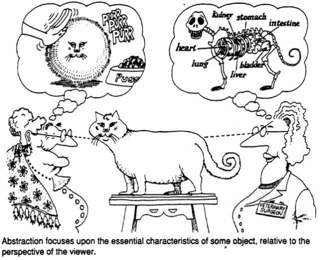

## Classes e Objetos
### Abstração 

--- 
### Objetivos

Nesta aula aprenderemos a:
 - Definir uma _classe_.
 - Adicionar _atributos_, _métodos_ e _construtores_ a uma classe. 
 - Aprender novos comandos básicos de Python.

---
### Classes e Abstrações
Considere um carro:
 1. Quais são as características de um carro?
 2. Que coisas pode "fazer" um carro ?
 3. Todos os carros alcançam a mesma velocidade ?

 

 Foto [Revista carro](https://revistacarro.com.br/)

---

### Classes

Abstração para agrupar objetos comuns que têm _o mesmo comportamento_.

Descrevem de maneira _abstrata_ o _comportamento_ dos objetos.

---

### Classes

>> A palavra classe vem da taxonomia da biologia. Todos os seres vivos de uma
>> mesma classe biológica têm uma série de _atributos_ e _comportamentos em
>> comum_, mas eles  __não são iguais__, podem variar nos valores desses atributos
>> e como realizam esses comportamentos.


--- 
### Objetos

Objetos são _instâncias_ de uma classe:

 - _Encapsulam_ um _estado_
 - Respondem às _mensagens_ com a execução de um _método_.

>> Os objetos de uma mesma classe _compartilham o comportamento_ definido pela sua classe.

---

### Atributo e Estado
O _estado_ de um objeto está definido pelos valores dos _atributos_ de classe.

Os tipos dos atributos podem ser:

 - Tipos primitivos: `int`, `float`, `double`, etc.
 - Tipos definidos pelo usuário (classes).


---
### Atributo e Estado
O _estado_ está definido pelos valores dos _atributos_.


---

### Objetos e Classes
Considere a classe _Círculo_:

 - Quais são as características de um círculo ?

Em C++ provavelmente definiríamos o tipo
```cpp
struct Circulo{
 double x,y;
 double raio;
 };
```


---

### Tipos estruturados vs POO
Entretanto, o tipo Circulo definido como _struct_:

- É utilizado apenas para armazenar dados
- Não tem um _comportamento_ definido

Solução: Classes! (C++ também suporta funções dentro de `struct`)

--- 
### Classes em Python

 - Em Python, todo é um objeto:
 ```python
>>> type(5)
< class 'int' >
>>> type("alo")
< class 'str' >
```

>> Variáveis possuem _tipos_ $\equiv$ objetos possuem _classes_

---

### Programação Orientada a Objetos
Programar orientado a objetos envolve:

- Identificar _classes_ que agrupam objetos com um comportamento comum.
- Identificar os __atributos__ que deve armazenar cada objeto.
- Identificar como os objetos devem *se comportar*.
- Identificar como devem *interagir* os diferentes objetos do sistema.


--- 

### Primeiro pilar de POO: Abstração

_Abstração:_ Escolher os aspetos _mais relevantes_ para representar uma entidade do mundo real.

 - Simplicidade: atributos irrelevantes devem ser ignorados.
 - Dividir e conquistar: o propósito de uma classe deve estar bem definido (com interfaces claras).

--- 

### Primeiro pilar de POO: Abstração



Imagem de [The Cat as a Metaphor in OO Software Development](https://effectivesoftwaredesign.com/2016/09/28/the-cat-as-a-metaphor-in-object-oriented-software-development/)

---

### Criando classes em Python
#### Construtores e atributos

```python
class Ponto:
  '''Representação de uma coordenada no plano cartesiano'''

  def __init__(self, x, y):
    '''Inicialização das coordenadas x e y'''
    self.x = x
    self.y = y
```

`__init__` é o construtor/inicializador da classe

`self` e a referência ao próprio objeto criado

`self` sempre deve ser o primeiro parâmetro

`self.x` e `self.y` são os 2 atributos (características)  da classe

---

### Instanciando a classe
#### Criando objetos
```python
P1 = Ponto(3,2) # P1 é um objeto do tipo Ponto
# Internatmente Python chama a __init__ com parâmetros 3 e 2
print(P1.x) # Acessar os atributos
print(P1.y)
```

---

### Métodos 
Definem o comportamento da classe

```python
class Ponto:
 ...
 def distancia(self, outro):
  '''Calcula a distância euclidiana entre self e outro'''
  return math.sqrt((self.x - outro.x) ** 2 
                 + (self.y - outro.y) ** 2)

def __str__(self):
  '''Retorna uma representação em formato string de um Ponto'''
  return f'({self.x},{self.y})'

```
Nosso primeiro "dunder" (método mágico).

`__str__` é invocado para converter um objeto em string

---

### Métodos 
#### Invocando métodos

```python
P1 = Ponto(1,2)
P2 = Ponto(0,0)
d = P1.distancia(P2) # Chamar um método (P1 == self)
s = str(P1) #chamar a __str__
print(P1.__str__()) # Alternativa (quase nunca utilizada)
```

---

### Jupyter Notebook 
<a href="03-classes-objetos.ipynb">03-classes-objetos</a>
