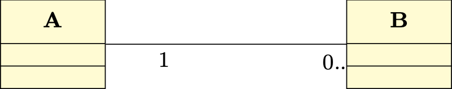
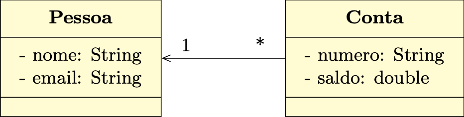
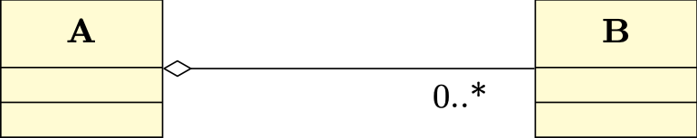
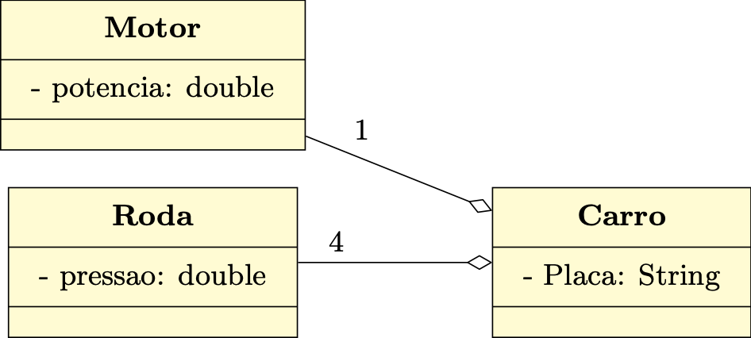
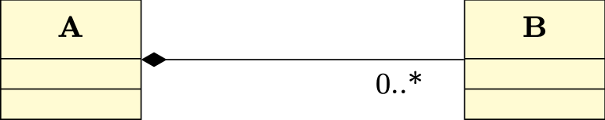
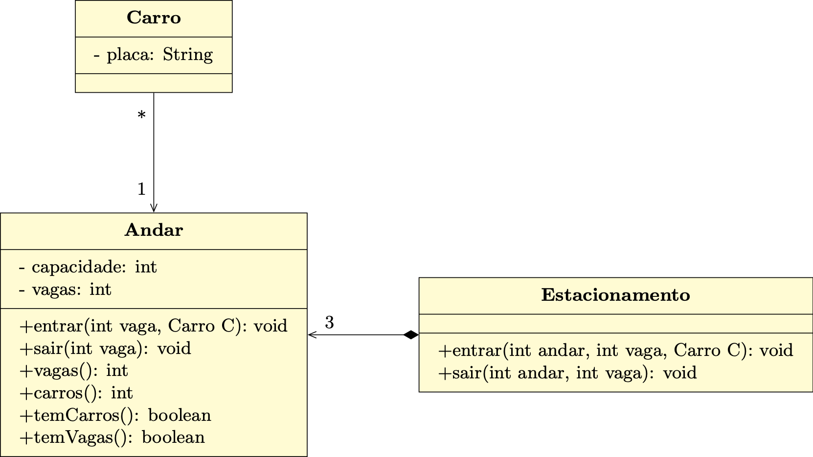

## Relacionamento entre Classes
---

### Revisão 

#### Classe
Abstração para agrupar objetos comuns

Descreve de maneira _abstrata_ o comportamento dos objetos. 

#### Objetos 
*Instâncias* de uma classe

Encapsulam um _estado_

---

### Revisão 

- _Atributos_: Características da entidade sendo modelada
- _Métodos_: Definem o __comportamento__
- _Construtor_: Inicializa os atributos
- `self`: auto-referência ao próprio objeto

---

### Objetivos

> As classes _não existem sozinhas_: elas têm _relacionamentos
> entre si_ que descrevem como as objetos __interagem uns com os outros__.  

Nesta aula aprenderemos:

 - Explicar como os objetos _se relacionam_ em um sistema orientado a objetos. 
 - Identificar os diferentes _tipos de relacionamento_ entre classes. 
 - Implementar relações entre classes em Python. 

---
### Interfaces e Encapsulamento
#### Membros privados de Classe

- *Atributos*: representando o _estado_ que _não deve ser visível_ para os usuários da classe.
- *Métodos*: usados internamente.

#### Membros Públicos

- Métodos que podem ser invocados _externamente_.
- Especificam um _contrato_: operações que o objeto pode e deve realizar

> Alterações no estado de um objeto geralmente ocorrem através da _invocação de seus métodos_.

---
### Encapsulamento

- Os dados de um objeto _não podem_ ser acessados diretamente.
- O relacionamento entre os objetos deve ocorrer por meio de _métodos públicos_ (a __interface__ da classe).

- __A ideia__: _Esconder os detalhes_ de implementação.

> As mudanças na implementação não devem afetar os usuários da classe.

---
### Relacionamentos de Associação 
 Indicam algum _relacionamento_ significativo e de interesse entre objetos

 Especificam que objetos de uma classe estão _ligados_ a objetos de outras classes. 

#### Exemplos
- Em um Estacionamento estão _estacionados_ os Carros.
- Um professor _ministra_ várias disciplinas.
- Uma mensagem _possui_ um Remitente é um Destinatário. 

---
### Relacionamentos de Associação 

- Um objeto tipo A está ligado com zero o muitos objetos tipo B.
- Um objeto tipo B está ligado com um objeto tipo A.

#### Multiplicidade:
 - `0` : zero
 - `0..1`: zero ou um
 - `1` : um
 -  `1..*`: um ou muitos
 - `0..*` ou `*`: zero ou mais

---
### Relacionamentos de Associação
#### Exemplo

Considere um banco: cada conta bancaria está relacionada com uma pessoa (o
titular da conta):

(ver Exemplo no notebook)

---
### Relacionamentos de Agregração

 Representa uma relação _todo-parte_.

 __As partes podem existir sem o todo__

#### Exemplos
 - Considere a relação entre o Carro, as Rodas e o Motor.
 - Considere a relação entre um computador,  o teclado, a tela

--- 
### Relacionamentos de Agregração

A é o __todo__

B são as __partes__

---
### Relacionamentos de Agregração

Considere um carro que possui 1 motor e 4 rodas

(ver exemplo no notebook)
    
---
### Relacionamentos de Agregração

- Objetos do tipo Motor e Roda são instanciados.
- Estas instâncias são associadas a um objeto do tipo Carro no inicializador
  deste último.  
- Ou seja, Motor, Roda e Carro podem ser instanciados independentemente.
- Quando a instância de Carro é removida da memória, as instâncias de Motor e
  Roda associadas continuam a existir

---
### Relacionamentos de Composição

Representa  uma relação _todo-parte_ mais *forte*.

Se o objeto todo deixar de existir, os seus objetos parte deverão também deixar
de existir. 

#### Exemplos
 - Um estacionamento e seus andares.
 - Um prédio e suas salas.

---
### Relacionamentos de Composição

A e o todo e B as partes.

A existência de B não  faz sentido se A não existir

---
### Resumindo
#### Associação
Modela uma relação genérica entre duas classes.

Nenhum objeto é considerado dono/proprietário do outro objeto

#### Agregração
Modela uma relação do tipo *tem um* fraca, ou seja, uma classe A é formada por
objetos de outra classe B.

Objetos da classe B podem existir sem que objetos da classe proprietária A
existam

---
### Resumindo
#### Composição
Modela uma relação do tipo *tem um* forte.

Objetos da classe B deixam de existir quando objetos da classe proprietária A
deixam de existir

---
### Exercício

Vamos  modelar um estacionamento com andares e controlar os carros dentro dele.
O design proposto é:

Implemente as classes necessárias. 
