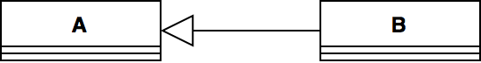
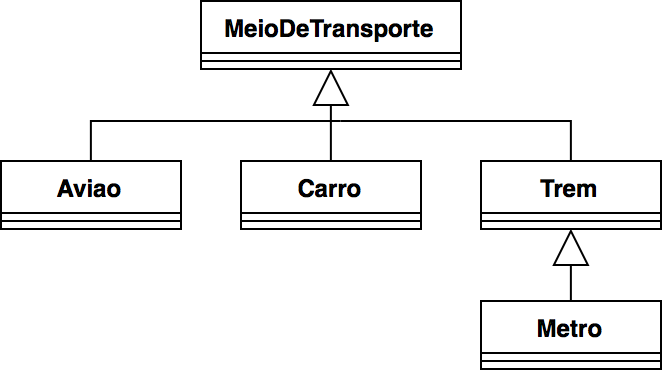

## Herança
---
### Objetivo

Apresentar o mecanismo de herança

- O que é herança em POO
- Como utilizá-la na linguagem Python
---
### Os Quatro Pilares de POO

- Abstração
- Encapsulamento
- **Herança**: _capacidade de uma classe herdar o comportamento definido por
  outra classe_
- Polimorfismo

--- 
### Herança
Mecanismo que permite a __reutilização de comportamento__ entre classes

Um novo tipo de _relacionamento_ entre classes

Esta relação acontece entre objetos _genéricos_ e objetos _específicos_ 

---
### Herança



- Relação do tipo "_ser um_": "um objeto B __é um objeto__ A"
- Classe B __herda__ o comportamento (atributos e métodos) da classe A
- A: classe base, classe mãe ou _superclasse_
- B: classe derivada, classe filha ou _subclasse_
- As superclasses devem oferecer comportamentos genéricos
- As subclasses devem oferecer comportamentos específicos

---
### Exemplos

- ```Pessoa``` e ```Aluno```: todo aluno (objeto específico) é uma pessoa
  (objeto genérico)
- ```MeioDeTransporte``` e ```Carro```: todo carro (objeto específico) é um meio de transporte
  (objeto genérico)
- ```Sensor``` e ```Sonar```: todo sonar (objeto específico) é um sensor
  (objeto genérico)
- ```Poligono``` e ```Triangulo```: todo triângulo (objeto específico) é um polígono
  (objeto genérico)

---
### Mais um exemplo


---
## Por que precisamos de Herança ?

As relações de herança definem uma __hierarquia de classes__ onde as subclasses
herdam as caracteríssticas da suas superiores.

Definir um comportamento em comum para objetos de uma mesma hierarquia

O código da classe base é reutilizado em todas as subclasses

Qualquer alteração no código da classe base é propagado para todas as subclasses

---
## Por que precisamos de Herança ?

> O comportamento __comum__ a varias classes pode ser definido em uma superclasse.
> As subclasses estendem (ou refinam) tal comportamento.

---
### Herança em Python
```python
# Classe A: classe base
class A:
    pass

# Classe B: classe derivada
class B(A):
    pass
```
---
### Reescrita de métodos

As subclasses herdam os atributos e métodos das superclasses 

Mas, as subclasses podem _reescrever_ os métodos da superclasse para definir um
comportamento mais específico. 

---
### Reescrita de métodos
```python
class Pessoa:
 def __init__(self, nome, snome, dn):
   self._nome = nome
   self._snome = snome
   self._dn = dn

 def idade():
   ...

 def assinar(self):
   print(f'{self._nome} {self._snome}')

...
```
---
### Reescrita de métodos

- Um médico é uma pessoa (com todos seus atributos e métodos).
- Além dos atributos da pessoa, o médico dever ter um CRM
- Os médicos assinam de forma diferente

```python
class Medico(Pessoa):
  def __init__(self, nome, snome, crm):
    #Inicializar a superclasse
    # super(): referência à superclasse
    super().__init__(nome, snome) 
    self._crm = crm

  #reescrever o método assinar
  def assinar(self):
    print(f'Dr(a). {self._nome} {self._snome}')

  ...
```

---
### Mais exemplos
- Jupyter [notebook](09-herança.ipynb)

