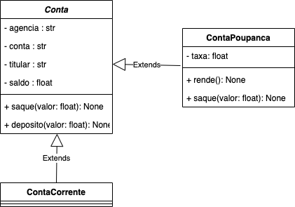
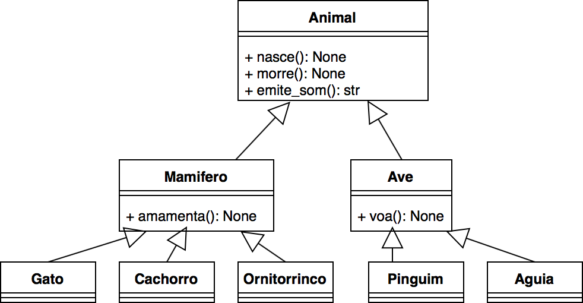

## Classes Abstratas
---

### Objetivo da aula

- Apresentar o mecanismo de __classes abstratas__
 - O que são classes abstratas
 - Identificar classes abstratas em um projeto orientado a objetos.
 - Como utilizá-las na linguagem Python

---
### Herança (revisão)

Permite que classes derivadas _herdem o comportamento_ (atributos e métodos) de
uma classe base

Introduz a relação _"é um"_ (ex.: "trem" é um "meio de transporte")

O código da superclasse é _reutilizado_ pelas classes derivadas

As classes derivadas podem _reescrever_ métodos da superclasse com
__funcionalidades específicas__

---
### Herança (revisão)

Observe o diagrama do exercício da aula anterior (omitindo a classe pessoa e
representando o titular como uma string):


 - Faz sentido criar objetos tipo ``Conta``?
 - Senão, qual é a utilizadade dessa classe ?

---
### Classe Abstrata

É uma classe que __não deve ser instanciada__

Define um _comportamento comum_ para outras classes derivadas

O código da classe abstrata pode  ser reutilizado/implementado por classes derivadas

Toda classe que não é abstrata é chamada classe **concreta**

---

### Método Abstrato

Estão presentes __somente em classes abstratas__

É um método _que deve ser rescrito_ por classes derivadas

Se a classe possui pelo menos um método abstrato, então ela é uma classe abstrata 
(não é possível instanciar objetos desta classe)

Em geral, um método abstrato não possui implementação (mas em Python podem possuir implementação)

---
## Classes Abstratas em Python

Em Python, as classe abstratas herdam da classe ```ABC```
(***A**bstract **B**ase **C**lass*), do módulo ```abc``` e tem, pelo menos, um
método abstrato (denotado com o decorador `@abstractmethod`):

```python
from abc import ABC, abstractmethod

class A(ABC):
    '''Exemplo de uma classe abstrata'''
    def __init__(self, v):
        self._v =v

    @abstractmethod
    def m(self):
        '''Método abstrato (sem implementação)'''
        pass 
```

---
## Classes Abstratos em Python

A classe `B` herda de `A` e provee um implementação para o método `m`:

```python
class B(A):
    def __init__(self,v,v2):
        super().__init__(v)
        self.v2 = v2

    def m(self):
        '''Implementando o método abstrato'''
        self.v2 +=1
        return self.v2
```

---
## Classes Abstratos em Python

- __Não é possível criar objetos a partir de uma classe abstrata__

```python
b = B(3,2) #OK
a = A(3) # Erro! Can't instantiate abstract class A with abstract methods m
```

---
### Exemplo Contas Bancárias

A classe `Conta` é abstrata (note que seu construtor é abstrato)
```python
class Conta(ABC):
    '''Conta bancária genérica'''

    @abstractmethod
    def __init__(self, ag, num, titular, saldo=0.0):
        self._ag = ag
        self._num = num
        self._titular = titular
        self.__saldo = 0.0
```

---
### Exemplo Contas Bancárias
A `ContaCorrete` herda de `Conta` e implementa o construtor:

```python
class ContaCorrente(Conta):
    def __init__(self, ag, num, titular):
        super().__init__(ag, num, titular)
```

---
### Exemplo Contas Bancárias
A `ContaPoupanca` é outra subclasse de `Conta` que reescreve o método `saque` e 
também implementa o método `rende`. 

```python
class ContaPoupanca(Conta):
    def __init__(self, ag, num, titular, saldo=0.0):
    ...

    def saque(self, valor):
    ...
```

---

## Observações Importantes

Classes concretas __não podem ter métodos abstratos__

Se a subclasse não reescreve *todos* os métodos abstratos da superclasse, ela é também abstrata. 

Uma classe abstrata pode ter métodos abstratos e métodos implementados

---
## Classe Abstrata - UML

Na notação UML, uma classe abstrata
possui seu nome *em itálico*:

Os métodos abstratos também são indicados com fonte itálica. 



ver exemplo completo [aqui](12-classes-abstratas.ipynb)

---
## Exercício

Considere o diagrama UML



---
## Exercício

- Identifique as classes e métodos que devem ser abstratos. 
- Implemente as classes
- Implemente um programa que crie uma lista de animais
  e inicialize este vetor com alguns animais.
  Em seguida, chame o método ```emite_som```
  com cada elemento da lista.
