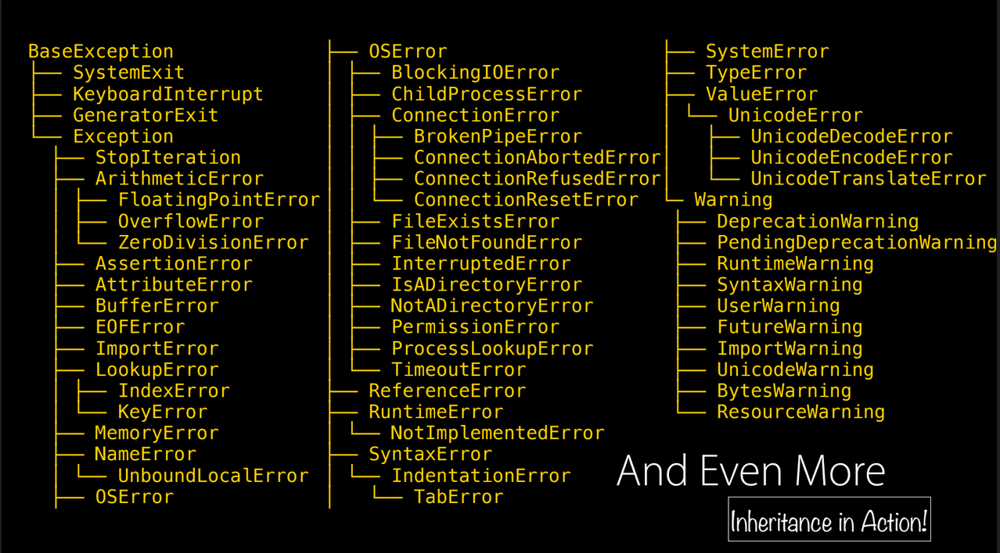

## Erros e Exceções

---
### Motivação

Considere os métodos a seguir:

```python
@nome.setter
def nome(self, n):
    '''Set para o nome de uma pessoa'''
    if type(n) == str:
        self._nome = n
    else:
        print('n precisa ser do tipo string')
```

```python
def entrar(self):
    '''Entra um carro'''
    if self.vagas > 0:
        self.vagas -= 1
        print("Um carro entrou.")
    else:
        print("Estacionamento sem vagas")
```

---
### Motivação

O programa _só imprime_ uma mensagem de erro

Entretanto, a execução do programa __continua__

Como fazer para o programa encerrar a sua execução?

Como __notificar__ de maneira clara que a execução do método não foi bem
sucedida?

Como __tratar/detectar__ (por exemplo, na  main) que a execução do método não foi bem sucedida?

---
### Motivação

Estamos interessados em fazer o programa "emitir um erro"

Emitir erro: notificar **e encerrar o programa**

O termo técnico para isto em programação é "fazer o programa __levantar uma exceção__"

Do inglês "*raise an exception*"

Também conhecido em português como "lançar uma exceção" ou "subir uma exceção"

---
### Motivação

Isso não é tão novo:

- Índice não valido (fora dos limites): 
>`IndexError: list index out of range`

- Divisão por 0:
> `ZeroDivisionError: division by zero`

- Uma variável inexistente é utilizada:
> `NameError: name x is not defined`

---
### Objetivo

Apresentar o mecanismo de tratamento de exceções

- O que é uma exceção
- Como levantar exceções em Python
- Como tratar exceções em Python
- Como implementar classes que denotam exceções em Python
- **Extra**: Funções com lista de parâmetros variável

---
### Exceções e Tratamento

Uma _exceção_ é um __erro__ não necessariamente fatal detectável na execução de um programa.

Para **levantar uma exceção**  utilizamos o comando `raise`

`raise C`: levanta uma exceção do tipo/classe C

Similar ao comando `throw` de Java e C++

`Exception` é a _superclasse_ das exceções definidas pelo usuário

A lista de classes de exceções predefinidas em Python está [aqui](https://docs.python.org/3/library/exceptions.html).

---
### Exceções e Tratamento


---
### Exemplo

```
def inv(n):
    '''N não pode ser zero'''
    if n == 0:
        raise ZeroDivisionError()
    else:
        return 1 / n

print(inv(2))
print(inv(0)) # ZeroDivisionError in line 10...
```

---
### Exemplo

```
class Conta:
    def __init__(self):
        self.__saldo =0

    def deposito(self,v):
        '''Deposito v > 0'''
        if v <= 0:
            raise ValueError("Valor de depósito não válido")
        else:
            self.__saldo += v

c = Conta()
c.deposito(3)
c.deposito(5)
c.deposito(0) # ValueError...
```
`ValueError`: Tipo de exceção que denota valores (de parâmetros) não válidos 
--- 
### Tratamento de exceções

Após levantada, uma exceção pode ser **tratada**

Tratamento de exceções: trecho de código responsável por fazer o programa se
__recuperar__ da exceção detectada

De acordo com a _classe/tipo da exceção_, o programa pode tratá-la de forma diferente

Se a exceção não for tratada, o _tratamento padrão_ é executado:
imprimir a mensagem de erro na tela e encerrar o programa

---

### Tratamento de exceções
```[1-4|5-7|9-16|18-27]
class Pessoa:
    def __init__(self, nome=''):
        self._nome = nome

    @property
    def nome(self):
        return self._nome

    @nome.setter
    def nome(self, x):
        '''x deve ser do tipo str'''
        if type(x) == str:
            self._nome = x
        else:
            #Note a mensagem adicional no construtor da classe TypeError
            raise TypeError('Exceçao: x precisa ser do tipo str')

if __name__ == "__main__":
    p = Pessoa()
    try:
        n = 3
        p.nome = n # ira levantar erro, já que n não é do tipo str
    except: # cláusula de tratamento de erros:
        print('Ocorreu um erro na leitura dos dados') 
        print('Atribuindo nome em branco') # atribui um nome padrão para pessoa
        p.nome = 'sem nome'
    print(f'Nome: {p.nome}')
```

`TypeError`: Exceção que denota um argumento de tipo não válido. 

---
### Try e Except

A cláusula `try` contém um bloco de código que _pode_ levantar exceções. Ela __tenta__
executar o bloco de comando nela contido. 

Se uma exceção for levantada por uma das linhas dentro do `try`,
  o fluxo do programa é _redirecionado_ para a cláusula `except`

As linhas do bloco `try` situadas após a linha de comando que levantou
      a exceção __não são executadas__

```python
try:
  # Tenta executar o bloco
  ...
except: 
  #tratamento
```
---
### Try e Except

Cláusula `except` _captura e trata_ exceções

É possível especificar várias cláusulas `except`, sendo
  uma para cada classe de exceção.

Apenas um except é executado por lançamento de exceção

```python
try:
  # Tenta executar o bloco
  ...
except Tipo1: 
  #tratamento
except Tipo2:
  #tratamento
```
---
### Try e Except

```
if __name__ == "__main__":
    p = Pessoa()
    try:
        p.nome = 'roberto'
        print(p.numero)
        print(f'Nome: {p.nome}, sobrenome: {p.sobrenome}') # outro erro: atributo inexistente

    except AttributeError:
        print('Erro acessando atributo inexistente')
    except Exception:
        print('Erro qualquer')
```

---
### Try e Except

Observe a ordem e hierarquia das exceções: AttributeError __é uma subclasse__ de Exception

Portanto, neste código: 

```
    except Exception:
        print('Erro qualquer')
    except AttributeError:
        print('Erro acessando atributo inexistente')
```

uma exceção do tipo `AttributeError` seria tratada no bloco `except Exception`
(e o segundo `except` _nunca_ será executado). 

---

### Except as object
- É possível capturar uma exceção
  como um objeto utilizando `as <objeto>`

- Isto permite acessar informações do erro levantado

```python
if __name__ == "__main__":
	p = Pessoa()
	try:
		p.nome = 3
	except Exception as err: # captura erro como um objeto
		print(err) # imprime informações sobre o objeto exceção
```

---
### Cláusula ```else```
  - O ```else``` é executado quando não há exceções capturadas
  - Útil para conter código que estaria após o ```try``` que
      só pode ser executado quando não há exceção

```
if __name__ == "__main__":
	p = Pessoa()
	try:
		n = (1,2,3)
		p.nome = n
	except Exception as err:
		print(err)
	else:
		print(f'Nome: {p.nome}')
	print('Fim do programa')
```

---

### Cláusula ```finally```

  - Executada por último, independentemente de exceções
      lançadas/capturadas
  - Útil para conter código relacionado ao ```try```
      para limpar recursos utilizados (ex.: fechar arquivos)

```python
if __name__ == "__main__":
	p = Pessoa()
	try:
		n = (1,2,3)
		p.nome = n
	except Exception as err:
		print('Erro: {}'.format(err))
	finally:
		print('Executando finally, independentemente de erros')
	print('Fim do programa')
```

---

### Resumo

Em resumo, o funcionamento das cláusulas
```try```, ```except```, ```else``` e ```finally```
podem ser vistos em um exemplo:

```
if __name__ == "__main__":
    for i in range(3):
        try:
            d = 10/i
        except ZeroDivisionError:
            print(f'Divisao por zero para i = {i}')
        else:
            print(f'Divisao por {i} efetuada sem erros')
        finally:
            print(f'Fim do try para i = {i}')

```
---
### Exceções não tratadas

- Ao levantar uma exceção com ```raise```, a função/método
  apenas levanta a exceção (não a trata)
- O código que utiliza uma chamada à função/método que levantou
  a exceção é quem deve tratá-la
- Caso ninguém trate uma exceção sucessivamente levantada,
  o Python executa o tratamento padrão

---
### Implementando Classes para Exceções

É possível definir classes para representar exceções personalizadas:

```
class Erro(Exception):
    pass
```

A inicialização de `Exception` pode ser feita com quantos parâmetros
  forem necessários

Os parâmetros passados no inicializador serão armazenados no atributo `args` (do tipo tupla)
```python
>>> E = Exception(1,2,3)
>>> E.args[0]
1
```
Ao herdar de ```Exception```, a classe ```Erro``` possui o mesmo
  inicializador

---
### Implementando Classes para Exceções

```
class ErroBasePessoa(Exception):
    pass

class ErroNome(ErroBasePessoa):
    pass

class Pessoa:

 @nome.setter
    def nome(self, x):
        if type(x) == str:
            self._nome = x
        else:
            raise ErroNome('Excecao: x precisa ser do tipo str', x, 'terceiro parametro', 4)
```
---
### Implementando Classes para Exceções
Note que `ErroNome` tem um número não definido de parâmetros.

Uma boa prática é:

- Definir uma classe base que herda de ```Exception``` para o seu programa
- Definir erros específicos, que acontecem no domínio do problema em questão, utilizando
  a classe base anterior como o topo da hierarquia (todos os erros herdam dela)
- Desta forma, exceções específicas ao domínio do problema podem ser capturadas
---

[Jupyter notebook](./erros.ipynb)
